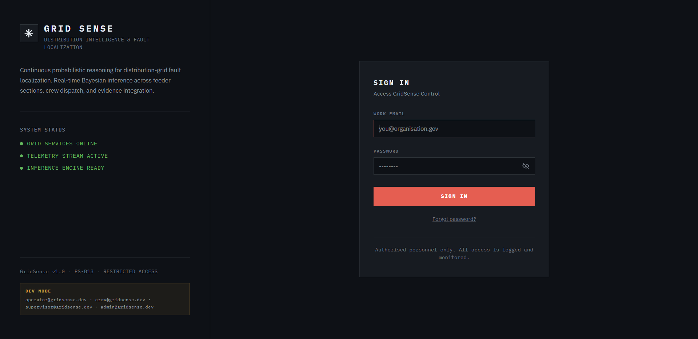
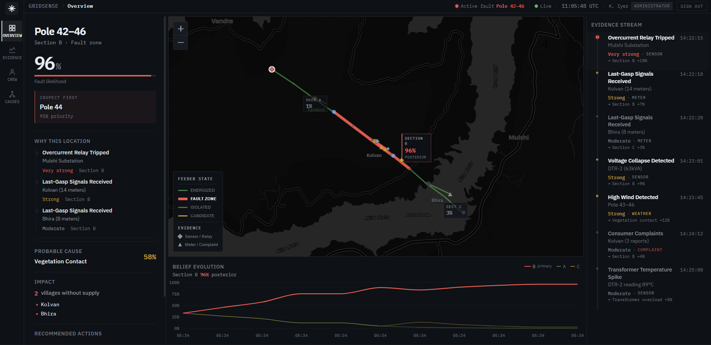
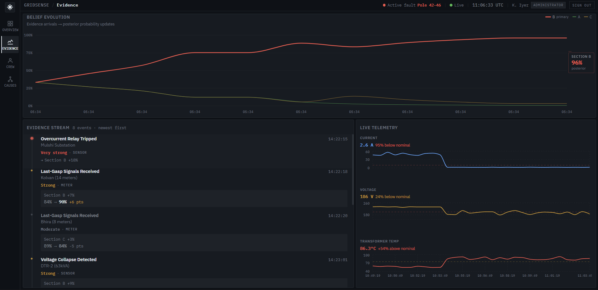
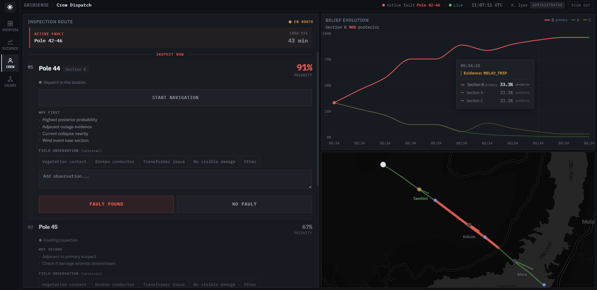
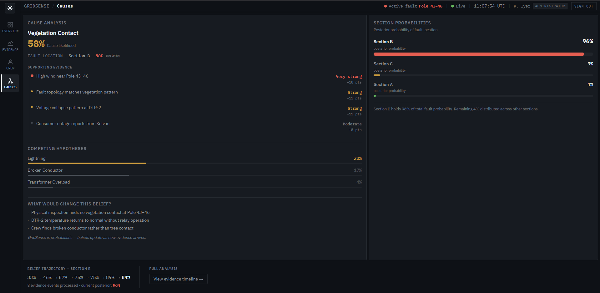

# GridSense

> **Probabilistic fault location for rural distribution feeders.**  
> PS-B13 · Innovate4Impact · Smart Technology & Innovation

GridSense applies Bayesian inference to streaming evidence — relay trips, smart meter last-gasp signals, voltage collapse events, weather alerts, and field crew reports — to produce a continuously-updating posterior probability of fault location and cause.

Designed for **control-room operators** and **field supervisors** who need a defensible, evidence-grounded answer to the question: *where is the fault, and how certain are we?*

---

## Table of Contents

- [What it does](#what-it-does)
- [Interface](#interface)
- [Authentication](#authentication)
- [Tech Stack](#tech-stack)
- [Project Structure](#project-structure)
- [Quick Start](#quick-start)
- [Scenario](#scenario)
- [Probable Cause](#probable-cause)
- [Key Implementation Notes](#key-implementation-notes)
- [Documentation](#documentation)
- [Roadmap](#roadmap)

---

## What it does

When a feeder trips, GridSense:

1. **Ingests evidence** from sensors, AMI meters, weather feeds, and consumer complaints
2. **Updates a Bayesian belief** over candidate fault sections in real time
3. **Generates an optimal crew inspection route** ranked by posterior probability
4. **Closes the loop** when crew feedback arrives — new evidence updates the belief immediately

The interface is built around a single operational question: **where is the fault?** Every component supports that question — nothing is decorative.

---

## Interface

Five views, each focused on a specific operational task:

### 0. Login

Role-based authentication screen with live system status. Supports four operator roles — each role is redirected to their appropriate default view on sign-in.



---

### 1. Dashboard (Overview)

Fault location · Posterior probability · Evidence chain · Impact · Recommended switching



---

### 2. Evidence

Belief evolution chart · Full evidence log · Live telemetry with anomaly interpretation



---

### 3. Crew Dispatch

Prioritised inspection route · Fault confirmation · Belief update feedback



---

### 4. Cause Analysis

Fault cause posterior · Supporting evidence strength · Competing hypotheses · Sensitivity



---

### Design Principles

| Principle | Implementation |
|-----------|----------------|
| Explicit labeling | Every percentage is labeled — `91% posterior probability`, `74% cause probability` — never a naked number |
| Qualitative strength | Evidence shown as `Very strong`, `Strong`, `Moderate` — not pseudo-quantitative deltas |
| Annotated belief chart | Belief evolution chart marks each evidence event that shifted the probability |
| Contextual telemetry | Shows deviation from baseline (`24% below nominal`), not raw values |
| Visible feedback loop | Crew confirmation visibly updates the belief: `Section B: 91% → 96%` |
| Strict semantic color | Red = fault/danger · Amber = warning/uncertainty · Green = healthy |

---

## Authentication

GridSense uses a **role-based authentication** system with four operator roles:

| Role | Default Route | Description |
|------|--------------|-------------|
| `CONTROL_ROOM_OPERATOR` | `/overview` | Full dashboard access |
| `SUPERVISOR` | `/overview` | Full dashboard access |
| `ADMINISTRATOR` | `/overview` | Full dashboard access |
| `FIELD_CREW` | `/crew` | Directed straight to dispatch view |

### Development Mode (Mock Auth)

Set `VITE_AUTH_MODE=mock` in `frontend/.env.development` to bypass the backend. Any non-empty password works with these accounts:

| Email | Role |
|-------|------|
| `operator@gridsense.dev` | Control Room Operator |
| `crew@gridsense.dev` | Field Crew |
| `supervisor@gridsense.dev` | Supervisor |
| `admin@gridsense.dev` | Administrator |

> **Note:** The mock adapter uses `sessionStorage` for session persistence and is **never active in production**. Set `VITE_AUTH_MODE=api` (the default) to use the FastAPI backend.

### Production Auth Endpoints

| Method | Path | Description |
|--------|------|-------------|
| `POST` | `/api/auth/login` | Authenticate with email + password |
| `POST` | `/api/auth/logout` | Clear server-side session |
| `GET` | `/api/auth/me` | Restore existing session on page load |

---

## Tech Stack

| Layer | Technology |
|-------|-----------|
| **Frontend framework** | React 18 + TypeScript + Vite |
| **Styling** | Tailwind CSS v4 + custom CSS design tokens |
| **Charts** | Recharts |
| **Map** | Leaflet + react-leaflet (CartoDB dark tiles) |
| **Fonts** | IBM Plex Sans (UI) · IBM Plex Mono (data, timestamps) |
| **State** | React Context + useReducer |
| **Routing** | react-router-dom v7 |
| **Auth** | Role-based; mock adapter (dev) + FastAPI adapter (prod) |
| **Backend** | FastAPI + Uvicorn |
| **Schemas** | Pydantic v2 |
| **Graph layer** | NetworkX (feeder topology DiGraph) |
| **Bayesian engine** | Pure Python — pgmpy available, currently custom implementation |
| **Change detection** | ruptures (change-point), River (online ML) |
| **Route optimisation** | OR-Tools (TSP/VRP) |
| **Data / GIS** | pandas, GeoPandas, Shapely |
| **Database** | PostgreSQL 16 + PostGIS (Docker) |
| **Testing** | pytest (71 tests, 0 failures) |

---

## Project Structure

```
GridSense/
├── frontend/                      # React + TypeScript UI
│   └── src/
│       ├── auth/                  # Authentication layer
│       │   ├── AuthContext.tsx    # Auth state — Provider + useAuth() hook
│       │   ├── ProtectedRoute.tsx # Route guard for authenticated pages
│       │   ├── authService.ts     # Mock + API adapter (driven by VITE_AUTH_MODE)
│       │   └── authTypes.ts       # AuthUser, AuthRole, AuthError types
│       ├── pages/
│       │   └── LoginPage.tsx      # Operational sign-in screen (role-based redirect)
│       ├── components/
│       │   ├── analysis/          # CauseBarList, SectionProbabilities
│       │   ├── crew/              # InspectionStops
│       │   ├── dashboard/         # FaultSummaryPanel, WhyThisLocation
│       │   ├── evidence/          # BeliefChart, EvidenceLog, TelemetryChart
│       │   ├── layout/            # TopBar (auth-aware), Sidebar
│       │   ├── map/               # FeederMap (Leaflet)
│       │   └── shared/            # AnimatedNumber, ProbabilityBar, StatusDot
│       ├── context/
│       │   └── GridContext.tsx    # Global fault state — single source of truth
│       ├── data/
│       │   ├── mockData.ts        # Scenario data, feeder topology, evidence log
│       │   └── mockEngine.ts      # Bayesian update simulation (temporary)
│       ├── views/                 # DashboardView, EvidenceView, CrewView, CauseView
│       └── index.css              # Design system tokens
│
├── backend/                       # FastAPI server + inference engine
│   ├── app/
│   │   ├── main.py                # FastAPI app — all REST endpoints
│   │   ├── schemas.py             # Pydantic API contracts
│   │   ├── data_gen.py            # Static mock store (to be replaced by engine)
│   │   ├── feeder_graph.py        # NetworkX feeder knowledge graph
│   │   └── services/
│   │       └── bayesian/
│   │           ├── engine.py      # BayesianInferenceEngine — core reasoning
│   │           ├── models.py      # Evidence, BeliefSnapshot, EngineState
│   │           ├── likelihoods.py # Likelihood tables per evidence type / cause
│   │           ├── demo.py        # CLI demo: full Mulshi inference walkthrough
│   │           └── tests/         # 71 unit + integration tests
│   ├── data/                      # Synthetic CSVs (Mulshi feeder scenario)
│   ├── requirements.txt
│   └── README.md
│
└── docs/
    ├── assets/                    # UI screenshots (login, dashboard, evidence, crew, causes)
    ├── index.md                   # Documentation index
    ├── local_setup.md             # Full local development setup guide
    ├── architecture.md            # Full system architecture + integration roadmap
    └── bayesian_engine.md         # Bayesian engine — math, API, numerical examples
```

---

## Quick Start

### Prerequisites

- **Python 3.12+**
- **Node.js 18+**
- **Docker Desktop** (for the PostgreSQL database)

### 1. Start the Database

```bash
# From the project root
docker-compose up -d
```

### 2. Backend

```bash
cd backend

# Windows
py -3.12 -m venv venv
venv\Scripts\activate

# macOS / Linux
python3 -m venv venv
source venv/bin/activate

pip install -r requirements.txt
uvicorn app.main:app --reload
# API:  http://localhost:8000
# Docs: http://localhost:8000/docs
```

### 3. Frontend

```bash
cd frontend
npm install
npm run dev
# App: http://localhost:5173
```

> For a detailed walkthrough including database seeding and troubleshooting, see [docs/local_setup.md](docs/local_setup.md).

---

## Scenario

```
Mulshi 33kV Substation
  │
  ├── Section A  (Poles 40–42)  ─── Tamhini      [Energized · 3% posterior]
  │
  ├── Section B  (Poles 43–46)  ─── Kolvan       [FAULT ZONE · 91% posterior]
  │         DTR-2 (63kVA)
  │
  └── Section C  (Poles 47–49)  ─── Bhira        [Downstream · 6% posterior]
```

**Evidence sequence:**

| Time | Event | Engine Effect |
|------|-------|---------------|
| 14:22:15 | Overcurrent relay trip — Mulshi Substation | A: 33%→9%, B/C: 33%→46% each |
| 14:22:18 | Last-gasp signals — Kolvan (14 meters) | B: 46%→68% |
| 14:22:20 | Last-gasp signals — Bhira (8 meters) | C rises slightly |
| 14:23:01 | Voltage collapse — DTR-2 | B: 68%→75% |
| 14:23:45 | High wind detected — Pole 43–46 corridor | Vegetation contact cause increases |
| 14:24:12 | Consumer complaints — Kolvan (3 reports) | B: 75%→82% |
| 14:25:00 | Transformer temperature spike — DTR-2 (89°C) | Transformer overload cause increases |
| 14:26:30 | Current near zero — Section B conductors | B: 82%→91% |

---

## Probable Cause

**Vegetation Contact — 74% cause probability**

Supporting evidence: high wind along the Pole 43–46 corridor (`very strong`), fault topology matching tree-contact pattern (`strong`), voltage collapse at DTR-2 (`strong`), consumer outage reports from Kolvan (`moderate`).

---

## Key Implementation Notes

### Authentication Layer

The app uses a **two-adapter auth pattern** in `authService.ts`:

- **Mock adapter** (`VITE_AUTH_MODE=mock`): sessionStorage-based, no backend required. For UI development and demos.
- **API adapter** (`VITE_AUTH_MODE=api`, default): Calls `POST /api/auth/login`, `POST /api/auth/logout`, `GET /api/auth/me` on the FastAPI backend.

`ProtectedRoute` wraps all authenticated routes; unauthenticated users are redirected to `/login`. On sign-in, `FIELD_CREW` is redirected to `/crew`; all other roles go to `/overview`.

### Recent Refinement Pass

The system recently underwent a comprehensive refinement pass to improve data semantics and UI coherence:

- **Data Semantics:** Replaced ambiguous percentage contributions with qualitative strength labels (e.g., `very_strong`) to reflect honest Bayesian reasoning.
- **Time Synchronization:** Anchored belief chart timestamps and evidence logs to the consistent scenario timeline (`14:22–14:26`).
- **Component Polish:** Removed redundant nested panels, enforced strict semantic color usage, applied explicit labeling for posterior/cause probabilities, and refined FeederMap GIS labels.
- **Authentication:** Added role-based login with mock and API adapters; TopBar now shows user name, role badge, and sign-out button.

### Bayesian Engine

The engine in `backend/app/services/bayesian/engine.py` is a **stateful, sequential Bayesian updater**. Each call to `engine.update(evidence)` applies Bayes' rule and the posterior becomes the prior for the next update. The engine integrates with the NetworkX feeder graph — relay trip evidence is resolved to downstream sections via graph traversal; meter outage evidence is resolved to supplying sections via graph lookup.

**71 tests pass. Zero failures.**

### Frontend State (Current)

The frontend currently uses `mockData.ts` and `mockEngine.ts` for all data. This is an intentional development phase — the backend is built and tested, the frontend is production-quality, and the connection is the next integration step.

### Timestamp Consistency

All timestamps — evidence log, belief history, telemetry, header — are anchored to the same scenario timeline (14:22–14:26 IST on 2026-08-08).

---

## Documentation

| Document | Description |
|----------|-------------|
| [docs/local_setup.md](docs/local_setup.md) | Full local setup — Docker, venv, database seeding, troubleshooting |
| [docs/architecture.md](docs/architecture.md) | Full system architecture, module descriptions, data flow, integration roadmap |
| [docs/bayesian_engine.md](docs/bayesian_engine.md) | Bayesian engine — math, evidence types, complete API reference, numerical example |
| [backend/README.md](backend/README.md) | Backend quick start, endpoint reference, engine usage, test commands |

---

## Roadmap

### Immediate
- [ ] Replace `mockData.ts` with `fetch()` calls to FastAPI endpoints
- [ ] Add `VITE_USE_MOCK=true` env flag as data fallback
- [ ] Wire `FAULT FOUND` / `NO FAULT` buttons to `POST /api/crew/confirm`
- [ ] WebSocket or polling for live telemetry feed
- [ ] Implement `POST /api/auth/login` + `GET /api/auth/me` on the backend

### Next
- [ ] Wire `BayesianInferenceEngine` into FastAPI endpoints
- [ ] Add `POST /api/evidence/update` — accepts evidence, returns updated posteriors
- [ ] Change-point detection (`ruptures`) on telemetry stream
- [ ] OR-Tools crew route endpoint

### Phase 2
- [ ] Multi-crew support
- [ ] Historical fault database and learning loop
- [ ] Mobile crew app with GPS-triggered stop confirmation
- [ ] Multi-feeder view with network-level switching optimisation
- [ ] GIS priority map export and fault report PDF

---

<div align="center">
  <sub>GridSense v1.0 · PS-B13 · Innovate4Impact · Restricted Access</sub>
</div>
